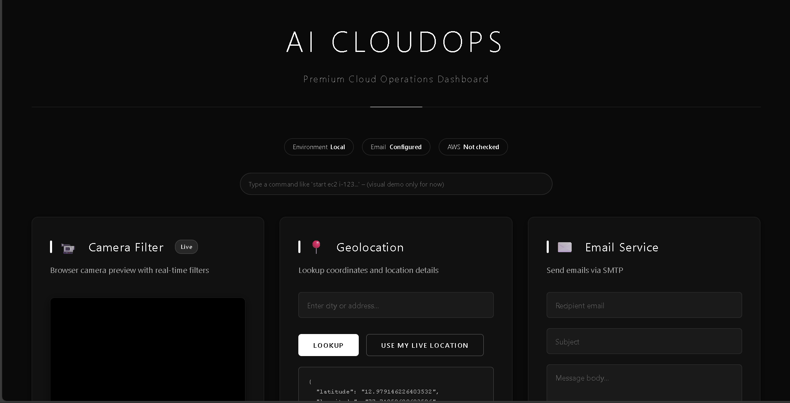
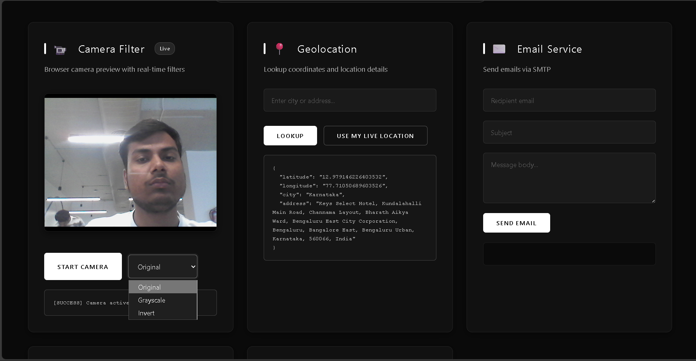
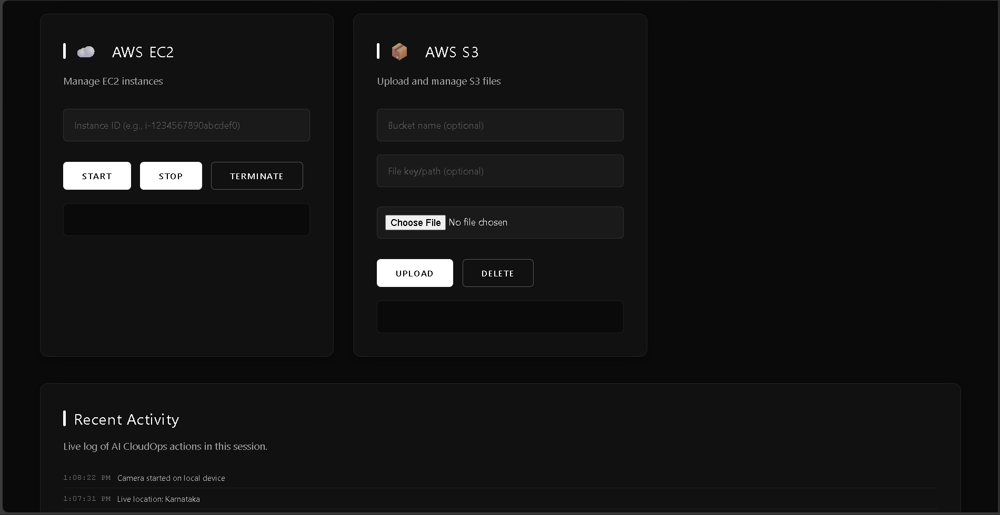

# Demo (Screenshots)

Add the 3 screenshots to this folder:

```
docs/screenshots/
  01-dashboard-top.png
  02-core-cards.png
  03-aws-and-activity.png
```

Then GitHub will render them here automatically.

## 1) Dashboard + Command Bar



## 2) Core Tools (Camera, Location, Email)



## 3) AWS Cards + Activity Feed



